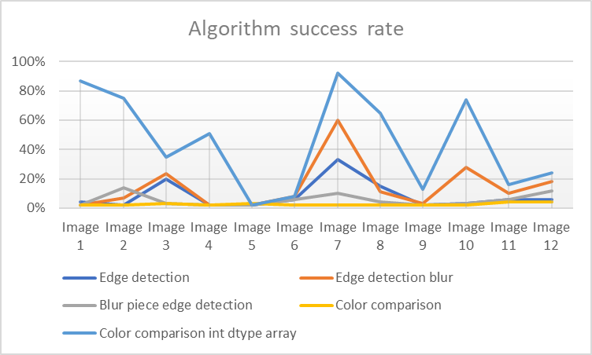
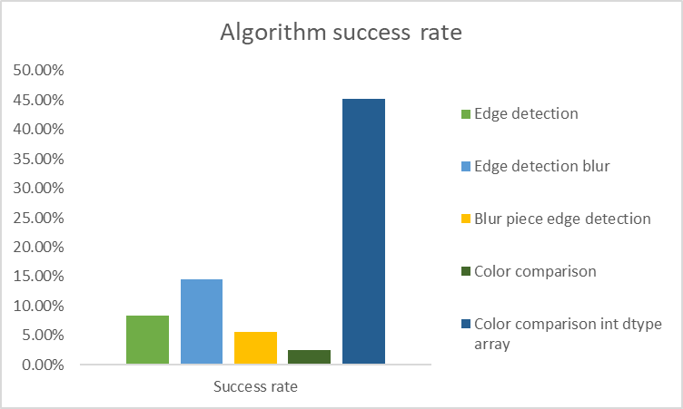

# Main information

--- 

App for scrambling and descrambling an image.

- Written in Python 3.9
- Descrambling works for scrambled images even outside of this app

### How to use

Fill in this section later!

### Sections

- [Scrambler](#scrambler)
- [Descrambler](#descrambler)
- [Challenges of this project](#challenges-of-this-project)

# Scrambler

---

## Information

Link: [Repository](/scrambler)

Takes an image, divides it into x pieces and shuffles them to create a puzzle.

***Arguments:***

| Argument     | Description                 |
|--------------|-----------------------------|
| `image_path` | path to the image           |
| `rows`       | wanted rows in the scramble |
| `cols`       | wanted cols in the scramble |

## Algorithm

App loads all the pieces into a list which is then randomly shuffled using the function `shuffle` from python
library `random`. Pieces are then put back into an image using `numpy` library, which is then returned back to the user.

The app doesn't fail if the width isn't divisible by the number of columns cleanly. The same goes for the height and
rows. Instead, the image is cropped until it fits cleanly. Keep this in mind when putting in the `rows` and `cols`
arguments!

# Descrambler

---

## Information

Link: [Repository](/descrambler)

Takes a shuffled image and un-shuffles it, returning what is presumed to be the original image before it was shuffled.

***Arguments:***

| Argument | Description                              |
|----------|------------------------------------------|
| `path`   | path to the image                        |
| `rows`   | number of rows in the scrambled image    |
| `cols`   | number of columns in the scrambled image |

## Algorithm

The algorithm can be divided into several steps

- Dividing the image into pieces
- Finding initial fitting edges between the pieces
- Correcting false positives
- Making the final image

### Dividing into pieces

App takes the arguments `rows` and `cols` that are given and calculates how big each piece should be based on the size
of the scrambled image. The image is then divided into the pieces based on the calculated size.

**NOTE:** If the image isn't cleanly divisible by the rows or cols provided, a warning is shown, however the app
progresses further without any issues using a cropped version that fits the clean division. It is highly advised to take
this into account when giving the algorithm the images or else the pieces can be cut incorrectly!

### Finding initial fitting edges between the pieces

The app is using a sort of bruteforce algorithm for figuring out which pieces fit next to which. This is done by taking
each piece and comparing it to every other piece using an algorithm, which returns a fitness value of how likely those
two given pieces are to be next to each other. This gives us a time complexity of `O(n^2)`.

### Correcting false positives

During the initial phase of finding likelihoods of pieces fitting together, it is very common to run into false
positives. Using just one edge for comparison is not enough to get accurate results and therefore all the pieces are
then run through a function that then tries to filter out these false positives by comparing to more edges.

This is done by taking fitness values from multiple edges and seeing which piece has the best fitness value overall.

### Making the final image

At this point, the pieces should be correctly assigned to each other. The problem of creating a proper image is that the
corners aren't properly shown in the scrambled image usually, making it difficult to tell which piece belongs where in
the image.

To circumvent this, the app creates an image that is bigger than what the original image was (*To be precise, it creates
exactly `(2x - 1)*(2y-1)` image, where `x` is the number of rows and `y` is number of columns of the original
scramble*). This image will contain the correct image inside it, the user just has to crop it themselves.

# Challenges of this project

---

## Tests

Writing tests turned out to be hugely helpful throughout the process of the project, especially throughout the
Descrambler part. The tests helped not only to figure out where bugs are, but also with the collection of data to be
used for the graphs seen in the category below.

## Matching the pieces together initially

Coming up with a good algorithm for the matching of the pieces has turned out to be pretty challenging. Several
algorithms were tried over the whole period of my work on this. Some of them being:

- Edge detection
- Contour detection
- Color comparison

The reasoning for edge detection was simple. See whether there is an edge in between the pieces or not. If there was no
edge, it should mean that the piece is very likely to be the fitting piece. However, this algorithm didn't give the
expected results back and therefore was later exchanged for a different one. It seems to have been taking the outlines
that are going from one piece to another as an edge, meaning that the more lines are going from one piece to another,
the more of an edge forms there and therefore the algorithm get tricked into thinking the pieces don't match.

Contour detection algorithm worked on the basis that two images that fit should have fewer contours than combined number
of contours in individual images as come lines cross the images. Again, this algorithm was flawed from the start as if
an image contains a lot of lines going through it initially, it will automatically be put in worse positions.

Color comparison on the other had a huge advantage over these two algorithms theoretically. Comparison the colors along
the edges and seeing which edges are the closest to each other. The potential problem with this algorithm is that since
most manga is a grayscale image (it is RGB image but the colors are still grayscale), it could be that it doesn't have
enough information to accurately judge the images.

***Here is some data that was obtained from writing tests:***

<h1 align=center>

</h1>

In the data, only some of the algorithms are seen, this is because tests were made only after some algorithms were
completely ruled out. For the algorithms that stayed, here is the basic description:

| Algorithm                        | Description                                                                             |
|----------------------------------|-----------------------------------------------------------------------------------------|
| Edge detection                   | OpenCV Canny edge detection on the pieces                                               |
| Edge detection blur              | OpenCV Canny edge detection but blurring the combined pieces a bit to eliminate noise   |
| Blur piece Edge detection        | OpenCV Canny edge detection but blurring the pieces before joining them                 |
| Color comparison                 | Comparing edges of pieces by color                                                      |
| Color comparison int dtype array | Comparing edges of pieces by color but edited the algorithm to use int instead of uint8 |

